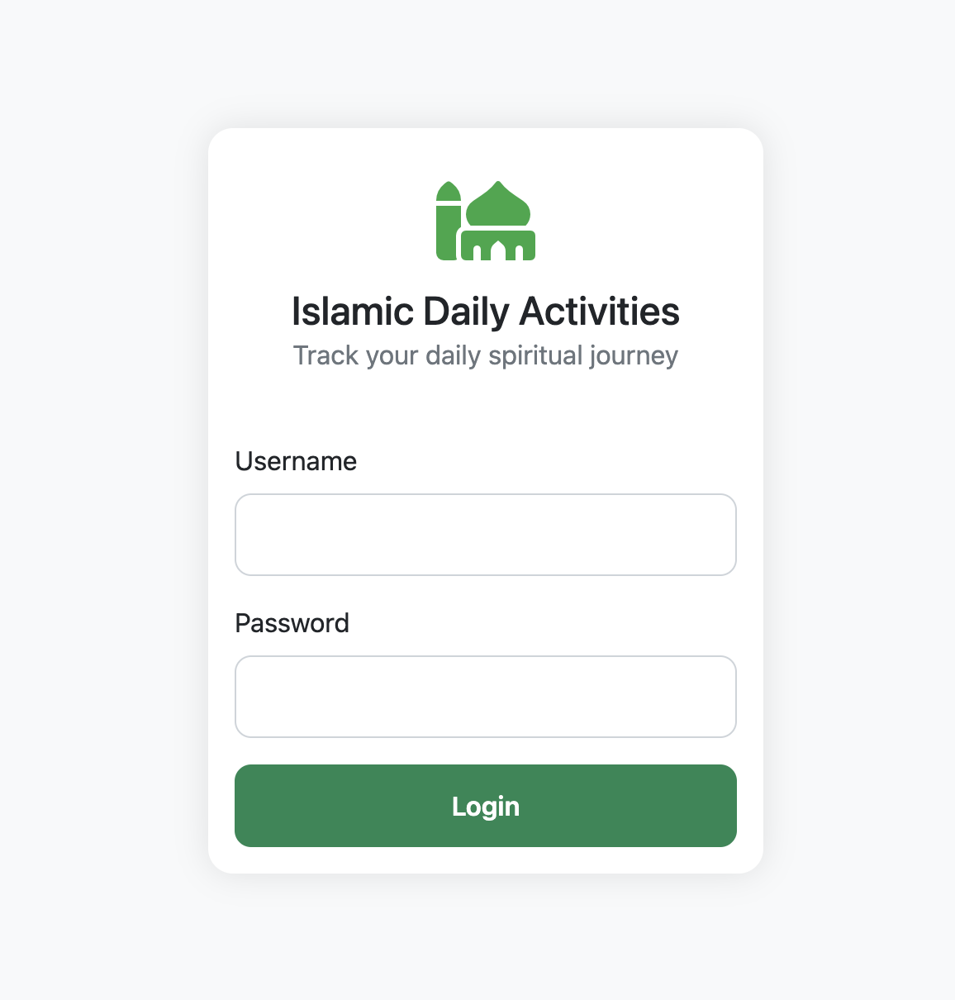
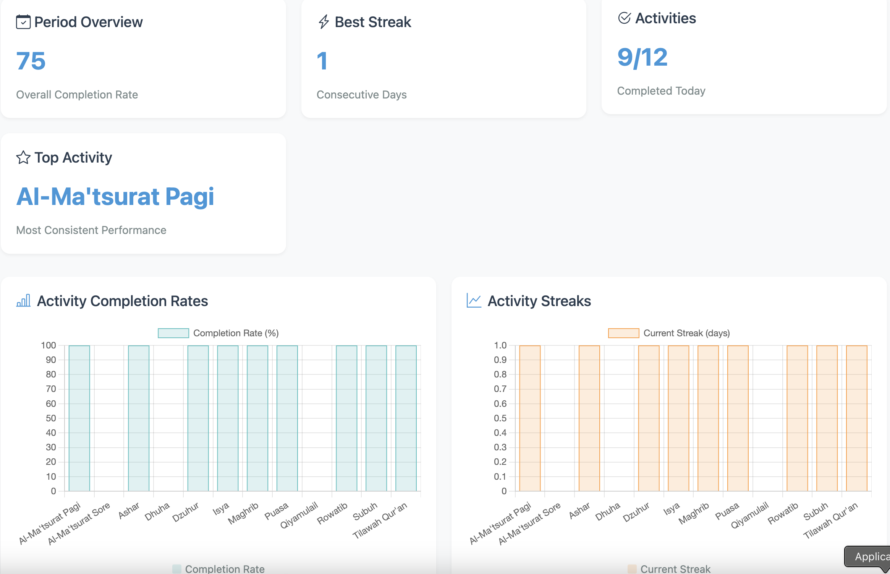
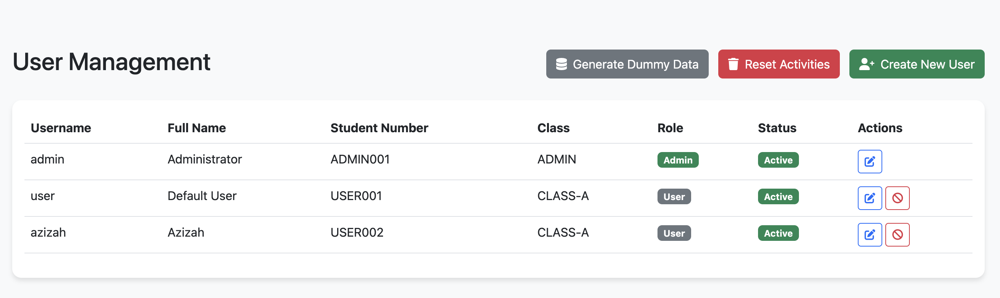

# Islamic Daily Activities Tracker

A web application to help track daily Islamic activities, designed for both mobile and desktop use. The application allows users to track their daily religious activities and maintain consistency in their practice.





## Features

- 📱 **Responsive Design**
  - Mobile and desktop friendly interface
  - Adaptive layout for different screen sizes
  - Touch-friendly controls for mobile users

- 🔐 **User Management**
  - Secure user authentication
  - Role-based access control (Admin/User)
  - Password encryption using bcrypt
  - User profile management

- ✅ **Activity Tracking**
  - Daily activity logging
  - Automatic streak tracking
  - Progress visualization
  - Auto-save functionality

- 📊 **Analytics & Reporting**
  - Multiple view options (Daily/Weekly/Monthly/Yearly)
  - Progress visualization through charts
  - Activity completion statistics
  - Streak tracking and records

## Tech Stack

### Backend
- **Framework**: Python Flask
- **Database**: PostgreSQL 12+
- **ORM**: SQLAlchemy
- **Authentication**: Flask-Login
- **Security**: Flask-Bcrypt

### Frontend
- **Framework**: Bootstrap 5
- **JavaScript**: Vanilla JS
- **Charts**: Chart.js
- **Icons**: Bootstrap Icons

## Installation

### Prerequisites
- Python 3.8+
- PostgreSQL 12+
- pip (Python package manager)
- Git

### Setup Steps

1. **Clone Repository**
```bash
git clone [your-repository-url]
cd manage_task
```

2. **Virtual Environment**
```bash
python -m venv venv
source venv/bin/activate  # On Windows: venv\Scripts\activate
```

3. **Dependencies**
```bash
pip install -r requirements.txt
```

4. **Environment Configuration**
```bash
cp .env.example .env
# Edit .env with your database credentials and settings
```

5. **Database Initialization**
```bash
python reset_db.py
```

## VPS Deployment Guide

### Prerequisites for VPS
- Ubuntu Server 20.04 LTS or newer
- Domain name pointing to your VPS IP
- Root or sudo access to VPS

### Server Setup

1. **Update System**
```bash
sudo apt update && sudo apt upgrade -y
```

2. **Install Required Packages**
```bash
sudo apt install -y python3-pip python3-venv nginx postgresql postgresql-contrib certbot python3-certbot-nginx
```

3. **Create Database**
```bash
sudo -u postgres psql
CREATE DATABASE tracker_muslim;
CREATE USER your_user WITH PASSWORD 'your_password';
GRANT ALL PRIVILEGES ON DATABASE tracker_muslim TO your_user;
\q
```

### Application Deployment

1. **Create Application Directory**
```bash
sudo mkdir /var/www/tracker_muslim
sudo chown $USER:$USER /var/www/tracker_muslim
```

2. **Clone Repository**
```bash
cd /var/www/tracker_muslim
git clone https://github.com/your-username/manage_task.git .
```

3. **Setup Virtual Environment**
```bash
python3 -m venv venv
source venv/bin/activate
pip install -r requirements.txt
pip install gunicorn  # For production server
```

4. **Configure Environment**
```bash
cp .env.example .env
nano .env
```

Update with production settings:
```env
FLASK_ENV=production
DB_USER=your_user
DB_PASSWORD=your_password
DB_HOST=localhost
DB_NAME=tracker_muslim
SECRET_KEY=your-secure-secret-key
```

5. **Setup Gunicorn Service**
```bash
sudo nano /etc/systemd/system/tracker_muslim.service
```

Add the following:
```ini
[Unit]
Description=Tracker Muslim Gunicorn Service
After=network.target

[Service]
User=your_username
Group=www-data
WorkingDirectory=/var/www/tracker_muslim
Environment="PATH=/var/www/tracker_muslim/venv/bin"
ExecStart=/var/www/tracker_muslim/venv/bin/gunicorn --workers 3 --bind unix:tracker_muslim.sock -m 007 app:app

[Install]
WantedBy=multi-user.target
```

6. **Configure Nginx**
```bash
sudo nano /etc/nginx/sites-available/tracker_muslim
```

Add the following:
```nginx
server {
    server_name your-domain.com;

    location / {
        include proxy_params;
        proxy_pass http://unix:/var/www/tracker_muslim/tracker_muslim.sock;
    }

    location /static {
        alias /var/www/tracker_muslim/static;
    }
}
```

7. **Enable Site & Setup SSL**
```bash
sudo ln -s /etc/nginx/sites-available/tracker_muslim /etc/nginx/sites-enabled
sudo nginx -t
sudo systemctl restart nginx
sudo certbot --nginx -d your-domain.com
```

8. **Start Application**
```bash
sudo systemctl start tracker_muslim
sudo systemctl enable tracker_muslim
```

### Git Setup and Updates

1. **Initialize Git Repository (if not done)**
```bash
git init
git add .
git commit -m "Initial commit"
```

2. **Add Remote Repository**
```bash
git remote add origin https://github.com/your-username/manage_task.git
git branch -M main
git push -u origin main
```

3. **Update Application**
```bash
cd /var/www/tracker_muslim
git pull origin main
source venv/bin/activate
pip install -r requirements.txt
sudo systemctl restart tracker_muslim
```

### Maintenance Commands

- **View Application Logs**
```bash
sudo journalctl -u tracker_muslim
```

- **Check Service Status**
```bash
sudo systemctl status tracker_muslim
```

- **Restart Services**
```bash
sudo systemctl restart tracker_muslim
sudo systemctl restart nginx
```

### Backup Database
```bash
pg_dump -U your_user tracker_muslim > backup_$(date +%Y%m%d).sql
```

### Security Recommendations

1. **Configure Firewall**
```bash
sudo ufw allow 80
sudo ufw allow 443
sudo ufw allow 22
sudo ufw enable
```

2. **Regular Updates**
```bash
sudo apt update && sudo apt upgrade -y
```

3. **SSL Certificate Renewal**
```bash
sudo certbot renew
```

## Configuration

### Environment Variables

```env
# Database Configuration
DB_USER=postgres
DB_PASSWORD=your_password
DB_HOST=localhost
DB_PORT=5432
DB_NAME=tracker_muslim

# Application Settings
FLASK_ENV=development
SECRET_KEY=your-secret-key
DEBUG=True
```

### Environment Types

- **Development** (`FLASK_ENV=development`)
  - Debug mode enabled
  - Detailed error messages
  - Auto-reload on code changes

- **Production** (`FLASK_ENV=production`)
  - Optimized performance
  - Minimal error details
  - Cached templates

- **Testing** (`FLASK_ENV=testing`)
  - Separate test database
  - Mock data generation
  - Test-specific configurations

## Using the Application

### User Types

1. **Admin Users**
   - Full access to all features
   - User management capabilities
   - System configuration access
   - Default credentials:
     - Username: admin
     - Password: admin123

2. **Regular Users**
   - Activity tracking
   - Personal dashboard access
   - Profile management
   - Default credentials:
     - Username: user
     - Password: user123

### Admin Panel

The admin panel provides tools for:
- User management (create, edit, deactivate)
- Activity monitoring
- System statistics
- Database management

### Activity Tracking

1. **Adding Activities**
   - Navigate to the main dashboard
   - Click on activity cells to mark completion
   - Activities are auto-saved
   - Numeric inputs available for certain activities

2. **Viewing Progress**
   - Use the dashboard filters
   - Check completion rates
   - Monitor streaks
   - View historical data

## Reading the Dashboard

The dashboard provides multiple views to help you track your activities:

### View Types

1. **Daily View**
   - Shows today's activity completion
   - Summary cards display:
     - Today's overall completion rate
     - Best streak achieved today
     - Number of activities completed today
     - Top performing activity
   - Charts show:
     - Individual activity completion rates for today
     - Current streaks for each activity
     - Heatmap showing today's activity pattern

2. **Weekly View**
   - Shows this week's activity completion (Monday-Sunday)
   - Summary cards display:
     - This week's overall completion rate
     - Best streak achieved this week
     - Total activities completed this week
     - Top performing activity
   - Charts show:
     - Activity completion rates for the week
     - Streak lengths for each activity
     - Heatmap showing daily patterns for the week

3. **Monthly View**
   - Shows selected month's activity completion
   - Summary cards display:
     - Monthly overall completion rate
     - Best streak achieved in the month
     - Total activities completed this month
     - Top performing activity for the month
   - Charts show:
     - Monthly completion rates per activity
     - Streak lengths achieved in the month
     - Heatmap showing daily patterns throughout the month

4. **Yearly View**
   - Shows selected year's activity completion
   - Summary cards display:
     - Yearly overall completion rate
     - Best streak achieved in the year
     - Total activities completed this year
     - Top performing activity for the year
   - Charts show:
     - Yearly completion rates per activity
     - Longest streaks achieved in the year
     - Heatmap showing activity patterns throughout the year

### Understanding the Charts

1. **Completion Rate Chart**
   - Bar chart showing completion percentage for each activity
   - Higher bars indicate better completion rates
   - Hover over bars to see exact percentages
   - Color-coded for easy interpretation

2. **Streak Chart**
   - Bar chart showing current/best streaks for each activity
   - Longer bars indicate longer streaks
   - Hover over bars to see exact streak lengths
   - Helps track consistency

3. **Activity Heatmap**
   - Calendar-style visualization of activity completion
   - Darker colors indicate higher completion rates
   - Hover over cells to see the date and completion rate
   - Helps identify patterns and consistency in activities

### Filtering and Navigation

- Use the view type dropdown to switch between Daily/Weekly/Monthly/Yearly views
- Use month/year selectors to navigate to different time periods
- All charts and statistics update automatically when filters change
- Data is cached for better performance

## Troubleshooting

### Common Issues

1. **Database Connection**
   - Verify PostgreSQL is running
   - Check database credentials in .env
   - Ensure database exists

2. **Login Issues**
   - Clear browser cache
   - Reset password if forgotten
   - Contact admin for account issues

3. **Data Not Saving**
   - Check internet connection
   - Verify user session is active
   - Try refreshing the page

## Contributing

1. Fork the repository
2. Create a feature branch
3. Commit your changes
4. Push to the branch
5. Create a Pull Request

## License

This project is licensed under the MIT License - see the LICENSE file for details.

## Acknowledgments

- Flask team for the excellent framework
- Bootstrap team for the UI components
- Chart.js team for visualization tools
- All contributors who have helped with the project
